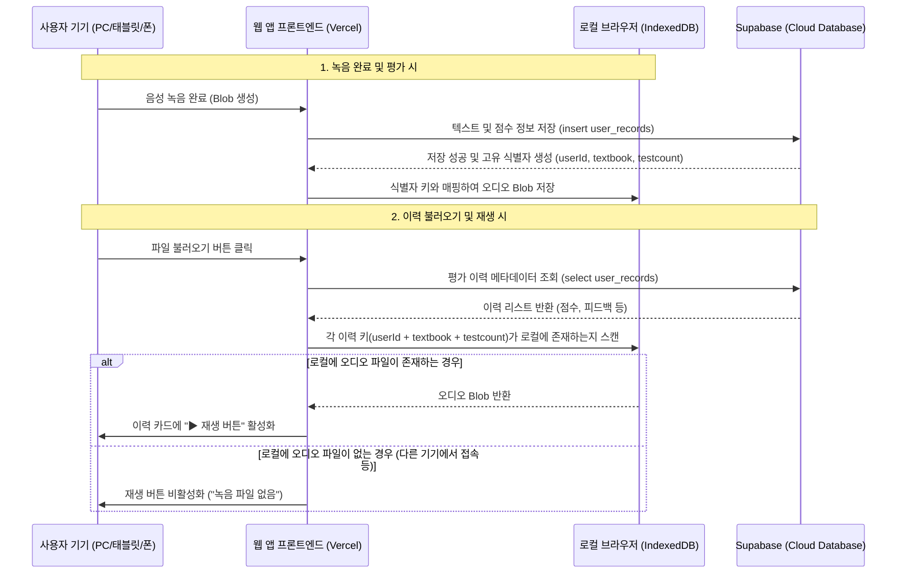

# 2027년 08월 05일 작업 내용

## 1. 작업 준비 및 환경 설정
* **작업 경로**: [d:\12. Antigravity\20260805_voice_tutor](file:///d:/12.%20Antigravity/20260805_voice_tutor) 폴더로 작업 기준 경로 설정 완료.
* **기록 문서 생성**: [docs\20270805_작업내용.md](file:///d:/12.%20Antigravity/20260805_voice_tutor/docs/20270805_%EC%9E%91%EC%97%85%EB%82%B4%EC%9A%A9.md) 생성 완료.
* **저장소 확인**: 향후 반영 시 `voice_tutor` 저장소로 PUSH할 예정 확인.

## 2. 모바일/태블릿/PC 기기별 로컬 오디오(MP3/WAV) 저장 기술 검토
Vercel 배포 환경에서 서버 및 Supabase의 용량/비용 제한을 극복하고, 사용자가 녹음한 음성 파일(WAV/MP3)을 기기별 로컬에 안전하게 저장하여 재사용할 수 있는 브라우저 웹 기술들을 비교 검토하였습니다.

### 가. 브라우저 로컬 저장 기술 비교

| 저장 기술 | 대상 기기 (PC/태블릿/폰) | 저장 용량 한도 | 바이너리(Blob) 지원 여부 | 특징 및 장단점 | 추천 여부 |
| :--- | :--- | :--- | :--- | :--- | :--- |
| **IndexedDB** | **모든 기기 지원**<br>(iOS Safari/Chrome, Android, Desktop) | **매우 큼**<br>(남은 디스크 용량의 50% 이상 사용 가능, 기기별 수백MB~수GB) | **직접 지원 (Blob/ArrayBuffer)** | - 별도의 권한 팝업 없이 무음 저장 가능<br>- 비동기 트랜잭션 방식으로 대용량 오디오 처리에 최적화<br>- Supabase의 레코드 키와 매핑하여 파일 검색 용이 | **★ 최우선 추천** |
| **OPFS**<br>(Origin Private File System) | 모던 브라우저 지원<br>(최신 iOS/Android 및 Desktop) | 매우 큼 (IndexedDB와 유사) | 지원 (File로 처리) | - 고성능 가상 파일 시스템<br>- 최근 웹 표준이나 구형 기기/브라우저 하위 호환성 측면에서 IndexedDB 대비 미세하게 불리함 | 검토 가능 (차선책) |
| **File System Access API** | **데스크톱 전용**<br>(모바일/태블릿 Safari, Chrome 미지원) | 제한 없음 (실제 로컬 드라이브에 직접 파일 생성) | 지원 | - 실제 기기 폴더에 파일을 읽고 씀<br>- 실행할 때마다 사용자의 디렉터리 접근 권한 승인이 필요하며, 모바일 브라우저 표준 지원 배제로 태블릿/폰 사용 불가 | 불가 (모바일 불가능) |
| **LocalStorage** | 모든 기기 지원 | **매우 작음 (약 5MB)** | 불가 (텍스트만 가능, Base64 변환 필요) | - 용량이 극도로 제한되어 수초 내외의 오디오 데이터도 저장 불가 | 불가 (용량 부족) |

---

### 나. 추천 솔루션: IndexedDB를 이용한 로컬 오디오 매핑 스토리지
태블릿, 스마트폰, PC를 아우르는 크로스 플랫폼 환경에서 사용자가 이력을 불러왔을 때 **해당 음성 파일을 로컬에서 찾아 바로 재생**할 수 있는 연계 구조를 다음과 같이 제안합니다.

#### 1) 연동 아키텍처


#### 2) 데이터 영구 보관 설정 (Eviction 방지)
기본적으로 브라우저는 디스크 용량이 부족해지면 로컬 저장소를 임의로 정리(Eviction)할 수 있습니다. 이를 방지하기 위해 **Storage Manager API**의 영구 저장소 모드를 호출하여 사용자가 명시적으로 브라우저 캐시를 지우지 않는 한 데이터를 영구 보관하도록 요청할 수 있습니다.
```javascript
if (navigator.storage && navigator.storage.persist) {
    const isPersisted = await navigator.storage.persist();
    console.log(`로컬 저장소 영구 보존 상태: ${isPersisted ? "보장됨" : "일반 웹 보관"}`);
}
```

---

### 다. 세부 기술 구현 가이드 (IndexedDB 코드 구조)

로컬 저장 및 조회를 위해 브라우저에 `local_audio_store` 오브젝트 스토어를 생성하고 아래와 같은 헬퍼 함수로 처리할 수 있습니다.

```javascript
// dbHelper.js - IndexedDB 매니저 예시
const DB_NAME = "VoiceTutorLocalDB";
const STORE_NAME = "local_audio_store";
const DB_VERSION = 1;

function openDB() {
    return new Promise((resolve, reject) => {
        const request = indexedDB.open(DB_NAME, DB_VERSION);
        request.onupgradeneeded = (e) => {
            const db = e.target.result;
            if (!db.objectStoreNames.contains(STORE_NAME)) {
                // userId + textbook + testcount를 조합하여 유니크한 keyPath 생성
                db.createObjectStore(STORE_NAME, { keyPath: "recordKey" });
            }
        };
        request.onsuccess = (e) => resolve(e.target.result);
        request.onerror = (e) => reject(e.target.error);
    });
}

// 오디오 Blob 로컬 저장 함수
async function saveLocalAudio(userId, textbook, testcount, audioBlob) {
    try {
        const db = await openDB();
        const transaction = db.transaction(STORE_NAME, "readwrite");
        const store = transaction.objectStore(STORE_NAME);
        
        const recordKey = `${userId}_${textbook}_${testcount}`;
        await new Promise((resolve, reject) => {
            const request = store.put({
                recordKey: recordKey,
                userId: userId,
                textbook: textbook,
                testcount: testcount,
                audioBlob: audioBlob,
                savedAt: new Date().toISOString()
            });
            request.onsuccess = () => resolve();
            request.onerror = () => reject(request.error);
        });
        console.log(`[IndexedDB] 오디오 로컬 저장 완료: ${recordKey}`);
    } catch (err) {
        console.error("오디오 로컬 저장 실패:", err);
    }
}

// 오디오 Blob 로컬 조회 함수
async function getLocalAudio(userId, textbook, testcount) {
    try {
        const db = await openDB();
        const transaction = db.transaction(STORE_NAME, "readonly");
        const store = transaction.objectStore(STORE_NAME);
        
        const recordKey = `${userId}_${textbook}_${testcount}`;
        return await new Promise((resolve, reject) => {
            const request = store.get(recordKey);
            request.onsuccess = () => {
                resolve(request.result ? request.result.audioBlob : null);
            };
            request.onerror = () => reject(request.error);
        });
    } catch (err) {
        console.error("오디오 로컬 조회 실패:", err);
        return null;
    }
}
```

---

### 라. 기대 효과 및 한계점
* **장점**: 
  - 서버 네트워크 대역폭 및 용량 비용 0원.
  - PC, iPad, iPhone, Android 폰 전 기종에서 추가적인 설정 없이 모던 웹 브라우저를 통해 완벽 구동.
  - 사용자는 과거 본인이 연습한 녹음 오디오를 버퍼링 없이 즉시 재생 가능.
* **한계 및 보완책**:
  - **기기 간 동기화 불가**: 기기 로컬에 저장되므로, 아이폰에서 녹음한 파일을 PC로 접속했을 때는 재생할 수 없습니다. (Supabase DB에서 데이터를 가져올 때 로컬 파일 여부를 확인하여 재생 버튼 노출 여부를 동적으로 처리하여 UI 혼선을 예방합니다.)

## 3. IndexedDB 로컬 오디오 저장 및 교재명 재생 아이콘 배치 구현 완료
제안드린 로컬 IndexedDB 저장 방식을 바탕으로 실제 소스코드 반영 및 연동 작업을 완료하였습니다.

### 가. 상세 작업 내역
* **HTML 마크업 수정**: 
  - [index.html](file:///d:/12.%20Antigravity/20260805_voice_tutor/frontend/index.html)의 `#label-active-filename` 우측에 음성 재생용 토글 버튼 `#btn-play-local-audio` 및 볼륨 아이콘 `#icon-local-audio-play`을 추가 배치하였습니다. (기본 style은 hidden)
* **IndexedDB 매니저 통합**:
  - [js/app.js](file:///d:/12.%20Antigravity/20260805_voice_tutor/frontend/js/app.js)에 `openAudioDB()`, `saveAudioBlobLocal()`, `getAudioBlobLocal()` 모듈을 구축하여 브라우저 저장소 트랜잭션을 일원화하였습니다.
* **평가 완료 시 자동 저장**:
  - `submitAssessment()` 단계에서 Supabase DB에 신규 레코드가 정상 등록 완료되면, 현재 기기의 녹음 본 `recordedWavBlob`을 동적으로 IndexedDB에 비동기 저장하도록 연계하였습니다.
* **이력 조회 시 재생 아이콘 표시 제어**:
  - `loadDbEvaluationDetail()` 함수를 통해 과거 이력을 화면에 로드할 때 해당 이력 식별값(`userId + textbook + testcount`)으로 IndexedDB를 스캔합니다.
  - 로컬에 녹음 데이터가 존재하는 이력인 경우, 교재명 우측에 스피커 아이콘 재생 버튼(`#btn-play-local-audio`)을 표출하고 오디오 소스를 로컬 Blob URL로 연동시킵니다. (데이터가 없을 시 버튼은 자동으로 감춰집니다.)
* **재생/일시정지 싱크**:
  - `toggleLocalAudioPlayback()`을 추가하여 교재명 옆 스피커 클릭 시 로컬 오디오의 재생 및 일시정지를 통제합니다.
  - `initAudioPlayerEvents()` 모니터링 이벤트 핸들러를 보강하여 오디오 재생 상태에 맞추어 아이콘 클래스(`fa-circle-pause` ↔ `fa-volume-high`)가 동적으로 업데이트되도록 처리하였습니다.


